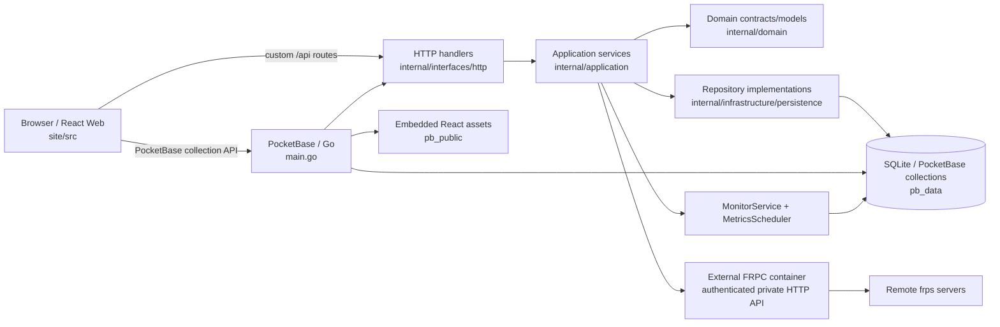
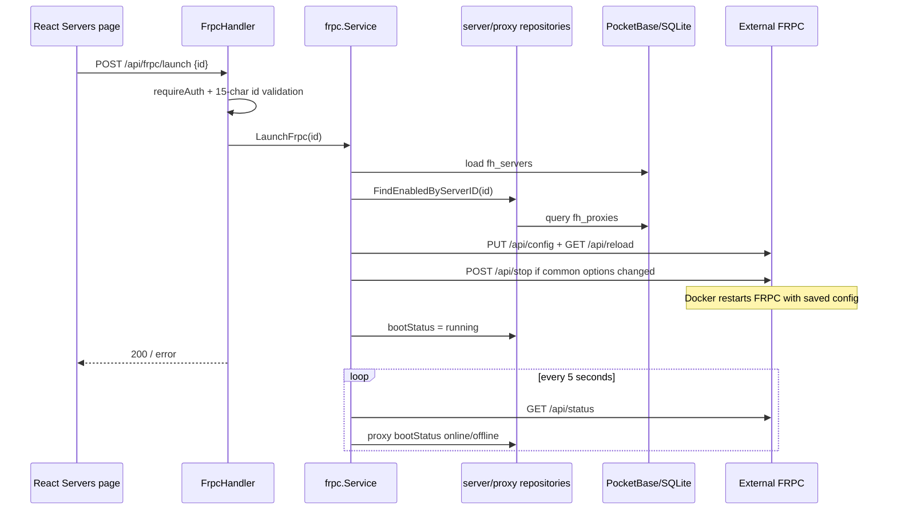
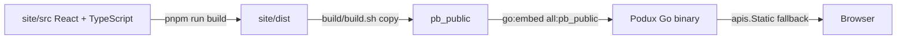

# System Architecture

## Verified Current State

Podux runs as a Go/PocketBase panel alongside an external FRPC container. The panel owns the SQLite database, configuration generation, monitoring and React assets. `internal/application/frpc/external.go` manages FRPC through its authenticated HTTP API; it does not embed or launch the client process. Docker owns FRPC restarts. The Go FRP dependency remains for configuration types only (0.68.0); the independently packaged runtime is 0.71.0. New FRP schema fields require panel support even when the binary can be upgraded separately.

### Layers and Entry Points

- `main.go` creates the PocketBase app, registers migration commands, constructs repositories/services/handlers, binds server/proxy configuration hooks, and initializes state, starts background tasks, registers routes, and configures the static-file fallback in `OnServe`.
- `internal/domain` currently defines lightweight models, status values, and repository interfaces only for servers and proxies.
- `internal/application` handles statistics, imports, frpc configuration/lifecycle, networking and metrics, system settings, and version queries.
- `internal/infrastructure/persistence` implements server and proxy repositories with dbx/PocketBase.
- `internal/interfaces/http` exposes `/api/dashboard/*`, `/api/frpc/*`, `/api/import/*`, `/api/servers*`, `/api/system/*`, and `/api/frp/version`. Except for initialization-status and initialization endpoints, registered custom routes use `requireAuth`.
- React also uses the PocketBase SDK directly for `fh_users`, `fh_servers`, and `fh_proxies`; collection API rules control that access boundary.

### Typical Request Flow

Standard server/proxy CRUD primarily uses the PocketBase SDK. Server lists, dashboard data, imports, settings, and runtime controls use custom APIs. After successful proxy create/update/delete, hooks reload the active profile. Common server-option edits restart only FRPC. Monitoring-only bootStatus updates do not reload the client. Hooks log and return apply failures; explicit reload also returns the failure to the UI. Saving a record and applying runtime configuration are separate operations.

### Startup Flow and Background Tasks

1. Go `init` loads `migrations`; `main` registers the migrate command and wires dependencies.
2. PocketBase `serve` triggers `OnServe`, which sets every server to `stopped` and every proxy to `offline`.
3. The saved active profile is reconciled immediately from `pb_data/runtime/active-server`. If none exists, the first autoConnection profile is started. Only one profile can run per FRPC container; stop it before switching. Panel restarts do not stop FRPC.
4. `MonitorService` immediately runs TCP latency and missing-geolocation checks, then repeats them at intervals from `fh_settings.general`; server-side defaults are 5 seconds and 24 hours.
5. PocketBase cron aggregates raw metrics into hourly metrics at minute 5 of every hour. At 01:05 each day it aggregates daily metrics and deletes raw data older than 7 days and hourly data older than 30 days.
6. After handlers are registered, `pb_public` is served through `embed.FS` with an SPA fallback; `/_/` remains the PocketBase Admin UI.

### Frontend Build and Embedding

The Vite development server listens on `0.0.0.0` and proxies `/api` to `127.0.0.1:8090`. Production builds do not automatically copy files to `pb_public`; CI performs that step through artifact downloads, while `build/build.sh` copies them explicitly. Go compilation still requires the directory to exist when `pb_public/index.html` is missing, and runtime logs a warning.

## Configuration, Persistence, and Deployment Boundaries

- PocketBase uses `pb_data/` as its default data root; the Docker volume mounts `/app/pb_data`. The database, uploads, and `pb_data/frpc/<id>/logs|certs` are runtime data.
- Server connection/authentication/transport/logging/metadata settings are stored in collection JSON fields. TLS certificate contents are written to a server-specific certificates directory at startup, with private-key permissions set to `0600`. Never commit this content.
- The fixed system-settings record ID is `wcstsqmz8hur331`; the initialization transaction creates both the first `fh_users` record and the settings record.
- Geolocation and version queries access external services and depend on network availability. database statuses are reset on panel startup then reconciled every five seconds from the external API. Profile running indicates a reachable client API; individual proxy online indicates its registered tunnel.
- The Dockerfile builds React and then compiles a static Go binary; deployment files define ports and volumes. This document makes no claims about production reverse proxies, backups, or high availability that are not verified in repository configuration.

## CI and Quality Boundaries

`.github/workflows/ci.yml` runs on pushes to main/dev and pull requests to main. It performs a frozen frontend install, permissive type checking (`continue-on-error`), and a production build; it then downloads the frontend artifact and runs `go vet` and a Linux amd64 build. CI currently does not run `go test`, frontend lint, or the documentation build, but this project's pre-submission baseline requires those checks locally. Pushes to dev also build and publish a multi-architecture container.

## To Be Confirmed

- `github_handler.go` and its service exist, but their wiring and registration are commented out in `main.go`; they must not be treated as a published API.
- No graceful-shutdown hook for `MonitorService` was found; it currently relies on process termination.
- No formal repository-level backup/restore, horizontal-scaling, or multi-instance mutual-exclusion design was found.

## Language selection

Client language support is declared in `site/src/lib/language.ts` (`ru`, `en`, `zh`).
Browser locale detection and saved preferences are shared by i18n startup, the
language provider, and setup. `/api/system/initialize` accepts `ru` and persists
it in the existing settings/user fields; the request schema is unchanged.

## External client configuration and rollback

`deploy/docker-compose.local.yaml` starts two containers sharing `/app/pb_data`, with the same UID 1000. Only the panel is published on host loopback (`17402`). FRPC port 7400 stays inside the Compose network, uses separate Basic Auth credentials, and the panel receives no Docker socket. Use one panel writer per shared volume.

Runtime JSON is stored in `pb_data/runtime/frpc.json`; the previous file is saved as `frpc.previous.json` before each update. A rejected strict reload restores the previous runtime file and reloads it. Database edits remain saved, so correct the record and reapply after an error. Common-option changes require FRPC restart and briefly interrupt tunnels. If its API fails to return, the old file is restored; an unhealthy running process may still need operator intervention. Restart health checks confirm API availability, not successful authentication to the remote FRPS.

Deployment and independent runtime updates are documented in [the external-client guide](../deploy/README.external.md). Go adapter tests are in `internal/application/frpc/external_test.go`.

### Container distribution and homelab recovery

`.github/workflows/packages.yml` publishes only the Podux panel to GHCR for AMD64/ARM64. `deploy/docker-compose.yml` consumes the versioned panel and the unmodified official `ghcr.io/fatedier/frpc` image; `deploy/docker-compose.local.yaml` builds only the panel. The old custom FRPC image is deprecated. Release Git tags use `podux-v*`, independently of the upstream binary-release workflow.

`EnsureRuntimeConfig` writes a private initial configuration atomically and preserves existing tunnels. Neither container waits for the other's health; FRPC waits for its config file, and startup auto-connect retries until its API returns. A manual stop is not undone by normal status polling. The inline Compose startup guard validates persistent JSON and restores a valid previous copy if necessary. Its paths are literal to survive CasaOS Compose conversion.

`deploy/docker-compose.casaos.yml` is the Linux host-network recipe. It retains host loopback targets and uses `FRPC_API_BIND=127.0.0.1`, `FRPC_API_PORT=7401` in both services, and `FRPC_API_URL=http://127.0.0.1:7401` in the panel. The panel listens on the explicitly chosen LAN address; the client administration API is not exposed to LAN/public clients. API credentials are kept in the private host env file and shared data directory. Panel user authentication remains enabled.

Optional host recovery units and scripts live in `deploy/homelab/`: a systemd boot unit starts Compose after Docker, network-online and the data mount; a timer recovers unhealthy running containers with a five-minute per-container cooldown; a daily private backup uses SQLite's backup API and retains seven archives. These scripts require their configured paths and CasaOS app id to match the deployment. The Docker restart policy handles client process exits independently of panel availability.

The client image tag can be updated without changing or building panel code. API/config changes in a future FRP release still require compatibility verification. Health checks verify local process/API availability; actual FRPS registration and backend responses are separate operational checks. Backups do not provide a second lab host, ISP or VPS, so a host/network outage still interrupts service until recovery.
