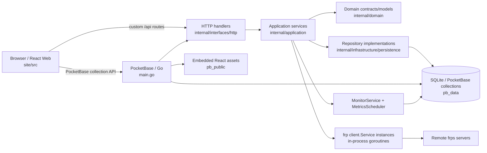
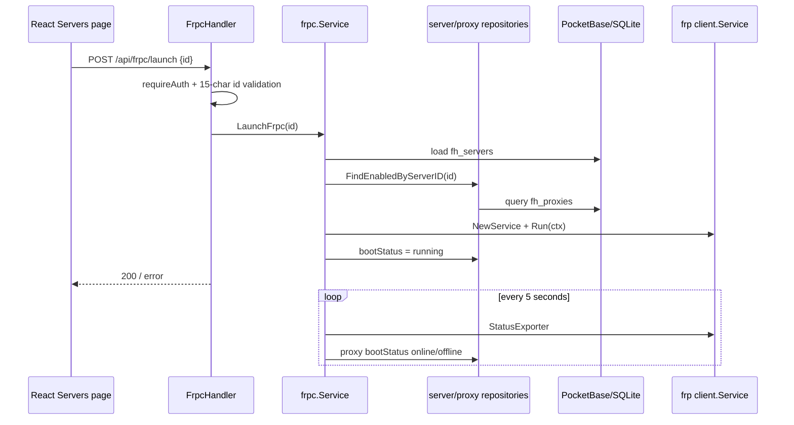

# 系统架构

## 已验证现状

Podux 是单个 Go/PocketBase 服务承载 API、SQLite 持久化、后台监控、frpc client service 和 React 静态站点的应用。代码将运行实例命名为 `processes`，但 `internal/application/frpc/service.go` 实际创建的是进程内 `frp/client.Service` 并在 goroutine 中运行，不会启动独立的 `frpc` OS 子进程。

### 分层与入口

- `main.go` 创建 PocketBase app、注册 migration 命令、构造 repository/service/handler，绑定 `fh_proxies` 更新 hook，并在 `OnServe` 中初始化状态、启动后台任务、注册路由和静态文件兜底。
- `internal/domain` 目前只为 server/proxy 定义轻量模型、状态值和 repository 接口。
- `internal/application` 承担统计、导入、frpc 配置/生命周期、网络与指标、系统设置和版本查询。
- `internal/infrastructure/persistence` 用 dbx/PocketBase 实现 server/proxy repository。
- `internal/interfaces/http` 暴露 `/api/dashboard/*`、`/api/frpc/*`、`/api/import/*`、`/api/servers*`、`/api/system/*`、`/api/frp/version`；除初始化状态/初始化接口外，注册中的自定义路由使用 `requireAuth`。
- React 还直接使用 PocketBase SDK 操作 `fh_users`、`fh_servers`、`fh_proxies`，访问边界由 collection API rule 控制。

### 典型请求链路

普通服务器/代理 CRUD 主要走 PocketBase SDK；服务器列表、dashboard、导入、设置和运行控制走自定义 API。`fh_proxies` 成功更新 hook 会在所属服务器运行时调用 `ReloadFrpc`。

### 启动流程与后台任务

1. Go `init` 加载 `migrations`，`main` 注册 migrate command 并完成依赖装配。
2. PocketBase `serve` 触发 `OnServe`：所有 server 置 `stopped`、proxy 置 `offline`。
3. 10 秒延迟后自动启动 `autoConnection=true` 的服务器。
4. `MonitorService` 立即并按 `fh_settings.general` 间隔执行 TCP 延迟与缺失地理位置查询；服务端默认间隔是 5 秒/24 小时。
5. PocketBase cron 在每小时第 5 分钟聚合 raw 到 hourly；每日 01:05 聚合 daily，并清理 7 天前 raw、30 天前 hourly。
6. handler 注册后，`pb_public` 通过 `embed.FS` 提供 SPA fallback；`/_/` 仍是 PocketBase Admin UI。

### 前端构建与嵌入

Vite dev server监听 `0.0.0.0`，将 `/api` 代理到 `127.0.0.1:8090`。生产构建不会自动复制到 `pb_public`；CI 通过 artifact 下载完成该步骤，`build/build.sh` 则显式复制。`pb_public/index.html` 缺失时 Go 编译仍要求目录存在，运行时会记录警告。

## 配置、持久化与部署边界

- PocketBase 默认数据根是 `pb_data/`；Docker volume 挂载 `/app/pb_data`。数据库、上传和 `pb_data/frpc/<id>/logs|certs` 都是运行数据。
- 服务器连接/auth/transport/log/metadata 存于 collection JSON 字段；TLS 证书内容启动时写入 server 专属 certs 目录，私钥权限为 `0600`。不得提交这些内容。
- 系统设置固定记录 ID 为 `wcstsqmz8hur331`；初始化事务同时创建首个 `fh_users` 记录和 settings 记录。
- 地理位置查询与版本查询会访问外部服务；具体可用性受网络影响。frpc 实例状态仅在内存中，重启时数据库状态先统一重置。
- Dockerfile 构建 React 后编译静态 Go 二进制；部署文件负责端口/volume。本文不声明未在仓库配置中验证的生产反向代理、备份或高可用方案。

## CI 与质量边界

`.github/workflows/ci.yml` 在 main/dev push 和 main PR 上运行：前端 frozen install、宽松的 type-check（`continue-on-error`）、正式 build；随后下载前端 artifact，执行 `go vet` 和 Linux amd64 build。CI 当前没有 `go test`、前端 lint 或 docs build 步骤，但本项目提交前基线要求本地补充执行。dev 分支 push 另构建并推送多架构容器。

## 待确认

- `github_handler.go` 和对应 service 存在，但 `main.go` 注释掉了装配与注册；不应视为已发布 API。
- 尚未发现优雅停止 `MonitorService` 的 hook；当前进程退出依赖进程生命周期。
- 尚未发现仓库内正式备份/恢复、水平扩展或多实例互斥设计。

