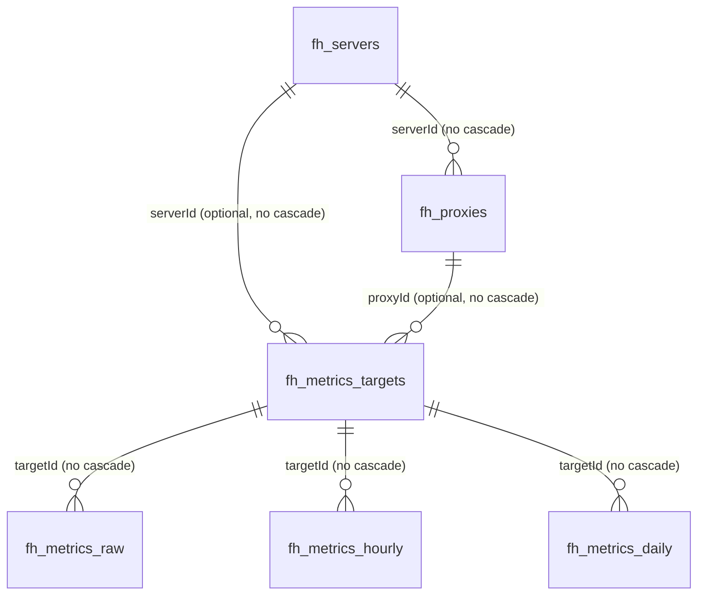

# 数据库设计

## 事实来源与迁移约束

PocketBase 使用 SQLite，并通过 `main.go` 空导入 `migrations` 注册 Go migration；`migratecmd` 开启 `Automigrate: true`。当前唯一 migration 是 `migrations/1774402980_collections_snapshot.go`，以 `ImportCollectionsByMarshaledJSON(..., false)` 导入 collection snapshot；回滚函数当前为空。因此 schema 的首要事实来源是 migration，而不是某个运行中 `pb_data/data.db`。

所有结构/rule/index 变更必须新增可审查 migration 并提供适当回滚，不得直接改生产 SQLite 或只在 PocketBase Admin UI 修改。下文“默认”只记录 snapshot 的 autogenerate 行为；未声明即无已验证 schema 默认值。

snapshot 还包含 `_mfas`、`_otps`、`_externalAuths`、`_authOrigins`、`_superusers` 等 PocketBase 系统 collection，本文不将其逐一建模。业务 collection 共 9 个：`fh_users`、`fh_servers`、`fh_proxies`、`fh_version`、`fh_settings`、`fh_metrics_targets`、`fh_metrics_raw`、`fh_metrics_hourly`、`fh_metrics_daily`。

所有 base collection 的 `id` 均为系统 text 主键、必填、自动生成 15 位小写字母数字；含 `created/updated` 的 collection 使用 autodate。表中 `—` 表示空规则，即只有 superuser 可经 PocketBase Record API 执行该操作；这不限制服务端内部 DB/service 访问。

## 关系图

关系字段全部 `maxSelect: 1`。schema 不保证每个 metrics target 只绑定 server 或 proxy，也没有 `(serverId, proxyId)` 唯一索引。

## Collection 设计

### `fh_users`（auth）

用途：Podux 登录用户。系统字段：`password`（必填、隐藏、min 8）、`tokenKey`（必填隐藏，30–60 字符，自动 50 字符）、`email`（必填）、`emailVisibility`、`verified`、`created`、`updated`。业务字段：`nickname` text 可选 max 255；`avatar` file 可选、最多 1 个、允许 JPEG/PNG/SVG/GIF/WebP；`passwordChangedAt` date 可选。

唯一索引：`tokenKey`；非空 `email`。password auth 启用且 identity 为 email；OAuth2、MFA、OTP 均关闭。create rule 为 `@collection.fh_settings.initialized = false`；list/view/update 仅 `id = @request.auth.id`；delete 同样仅本人；auth rule 为空（允许认证）。

映射：`system.Service.InitializeSystem` 创建用户；Login 用 PocketBase `authWithPassword`；Settings/Profile 读取/更新用户和头像，ChangePasswordDialog 更新密码。

### `fh_servers`

用途：远程 frps 连接及 frpc 公共配置。

| 字段 | 类型 | 必填/默认 | 说明 |
| --- | --- | --- | --- |
| `serverName` | text | 必填 | 显示名 |
| `serverAddr` | text | 必填 | frps 地址 |
| `serverPort` | text | 必填 | service/frontend 以 int 读取/编辑 |
| `description` | text | 可选 | 描述 |
| `auth` | json | 可选 | frp auth，可能含 token/secret |
| `transport` | json | 可选 | frp transport/TLS，可能含证书私钥 |
| `metadatas` | json | 可选 | frp metadata |
| `log` | json | 可选 | frp log config |
| `serverVersion` | text | 必填，自动 `built-in` | 当前 frp 来源标记 |
| `bootStatus` | text | 必填，自动 `stopped` | 运行状态；代码使用 running/stopped |
| `autoConnection` | bool | 可选 | 启动后自动连接 |
| `geoLocation` | json | 可选 | MonitorService 回填 |
| `user` | text | 可选 | frp user |
| `created`,`updated` | autodate | 自动 | 创建/更新时间 |

索引：`bootStatus` 非唯一。list/view/create/update/delete rule 均要求已认证。映射：无完整 Go domain model，`ServerRecord` 只覆盖 id/name；server repository、frpc service、monitor service、custom `/api/servers` handler 读取；React Servers/ServerDetail/ServerForm 使用。

### `fh_proxies`

用途：某个 server 下的 frpc proxy 配置。

| 字段 | 类型 | 必填/默认 | 说明 |
| --- | --- | --- | --- |
| `name` | text | 必填 | proxy 名；运行名追加 record id |
| `proxyType` | select | 必填 | tcp、udp、http、https 单选 |
| `serverId` | relation -> `fh_servers` | 必填，N:1 | 不级联删除 |
| `localIP`,`localPort`,`remotePort`,`subdomain` | text | 可选 | 端点配置；Go 对 port 用 NullableInt 映射 |
| `customDomains` | json | 可选 | 域名数组 |
| `transport`,`plugin` | json | 可选 | proxy 扩展配置 |
| `status` | select | 必填 | enabled/disabled |
| `bootStatus` | select | 必填 | online/offline |
| `created`,`updated` | autodate | 自动 | 创建/更新时间 |

索引：`serverId`、`proxyType`、`status`，均非唯一。全部 CRUD/list/view rule 要求已认证。映射：`domain/proxy.Proxy`、proxy repository/service、frpc config 生成与 dashboard；React Proxies、ProxyForm、ServerDetail 使用。更新成功 hook 对运行中的 server reload。

### `fh_settings`

用途：系统初始化状态和通用设置。字段为 `initialized` bool 可选、`general` json 可选、`created/updated` autodate，无业务索引。list/view/create/update/delete rule 均要求已认证，但初始化由无认证 custom API 在服务端事务内写入固定 ID `wcstsqmz8hur331`。`general` 已使用键包括 `defaultLanguage`、`latencyCheckInterval`、`locationCheckInterval`。

映射：`application/system.Service`、system handler、React GeneralSettings/初始化流程。

### `fh_version`

用途：版本名称/路径记录；字段 `version_name`、`version_path` 均为可选 text，加 `created/updated`。无业务索引，所有 Record API rule 都为 `null`。当前 version service 返回编译依赖中的 frp 版本，系统版本走 buildinfo/外部 release API；未找到对该 collection 的业务读写调用，实际用途待确认。

### `fh_metrics_targets`

用途：把指标序列绑定到 server 或 proxy。`serverId` 可选 relation -> `fh_servers`；`proxyId` 可选 relation -> `fh_proxies`；均不级联。无 `created/updated`、无索引、所有 Record API rule 为 `null`。`MetricsService` 当前只创建 `serverId` 有值且 `proxyId` 为空的 target，并以内存 map 缓存 server->target。

### `fh_metrics_raw`

用途：原始指标点。`targetId` 必填 relation -> `fh_metrics_targets`、不级联；`metricKey` 可选 select（当前仅 `frps_delay`）；`t` 必填 date；`val` 可选 number。复合非唯一索引顺序为 `(targetId, t, metricKey)`；无 autodate；所有 Record API rule 为 `null`。MonitorService 写入可达服务器的非负延迟；每日 01:05 删除 7 天前数据。

### `fh_metrics_hourly`

用途：每小时聚合。`targetId` 可选 relation、`metricKey` 可选 select、`t` 可选 date、`valAvg/valMax/valMin` 可选 number。复合非唯一索引 `(metricKey, targetId, t)`；无 autodate；所有 Record API rule 为 `null`。每小时第 5 分钟聚合上一完整小时并按 target/key/time 查找后更新或插入；每日删除 30 天前数据。

### `fh_metrics_daily`

用途：每日聚合。字段与 hourly 相同且三个 value 字段均为可选 number；复合非唯一索引 `(targetId, metricKey, t)`；无 autodate；所有 Record API rule 为 `null`。每日 01:05 从前一日 hourly 聚合并 upsert；代码当前只写 `valAvg`。未发现 daily 数据清理策略。

## 生命周期、删除与敏感性

- 启动时 server/proxy 运行状态被重置；状态属于瞬时运行投影，配置本身持久化。
- raw -> hourly -> daily 分层聚合；raw 保留 7 天、hourly 30 天，daily 无已验证上限。
- 所有 relation 都是 `cascadeDelete: false`。删除 server 不会由 schema 自动删除 proxy/metrics target，删除 proxy/target也可能留下关联记录；UI 删除前虽有确认框，但未发现服务端事务清理，需视为孤儿风险。
- `fh_users.password/tokenKey` 由 PocketBase 保护；`fh_servers.auth/transport` 可含 token、OIDC secret、TLS 私钥。日志虽对常见 JSON 密钥名做遮罩，但设计上仍不得导出、提交或回显原值。
- migration 变更流程：确认调用方 -> 新增 forward/down migration -> 更新 model/repository/service/UI -> 更新本文 -> 在临时数据库验证升级和回滚 -> 执行完整检查；禁止改 snapshot 伪造已有部署历史。

## 现状差异 / 待确认

- `domain/proxy.Proxy` 声明并序列化 `description`，但 `fh_proxies` migration 没有该字段；表单 payload 也包含 description。不得在本文假定字段已存在。
- `/api/servers` handler 读取并返回 `sendRate`、`recvRate`，migration 未定义两字段。
- ProfileSettings 同时提交 `name` 和 `nickname`，migration 只定义 `nickname`。
- migration 定义 `serverPort/localPort/remotePort` 为 text；Go/前端部分路径按数字使用，需保持转换兼容并确认长期类型策略。
- `fh_metrics_targets` 无唯一约束，仅应用进程内锁避免同一进程并发重复；多实例或已有重复数据风险待确认。
- metrics 聚合是应用层“先查再写”，复合索引非唯一，数据库不保证幂等唯一性。
- `fh_version` 没有已发现调用路径；用途待确认。
- snapshot migration 的 down 函数为空，无法自动恢复导入前 schema；迁移回滚策略待治理。

